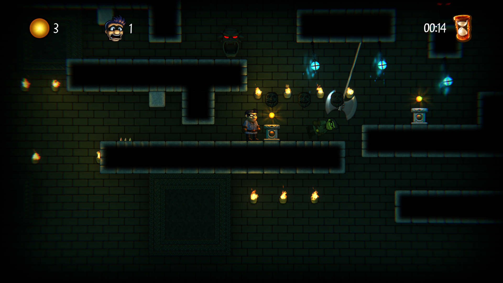

# Robbies-demo

复刻游戏：《Robbie Swifthand and the Orb of Mysteries》

游戏规则：使用空格跳跃，使用↓+空格蓄力蹲（学习：[【开发杂谈】横板平台跳跃手感 - 奶牛关 (cowlevel.net)](https://cowlevel.net/article/2017835)）

设计摆锤、地刺、落石三种不同的陷阱，Robbie需要绕过所有陷阱，收集齐宝珠打开大门过关。

学习到的：规则贴图Tiles -> RuleTiles+随机图案output Random可以大幅减少画图时间。同时要注意和sorting Layer的配合。

可以把陷阱、宝珠设计成Prefab Brush也更方便作图。

强大的Post Processing使用方法和添加相机抖动的效果。

test
